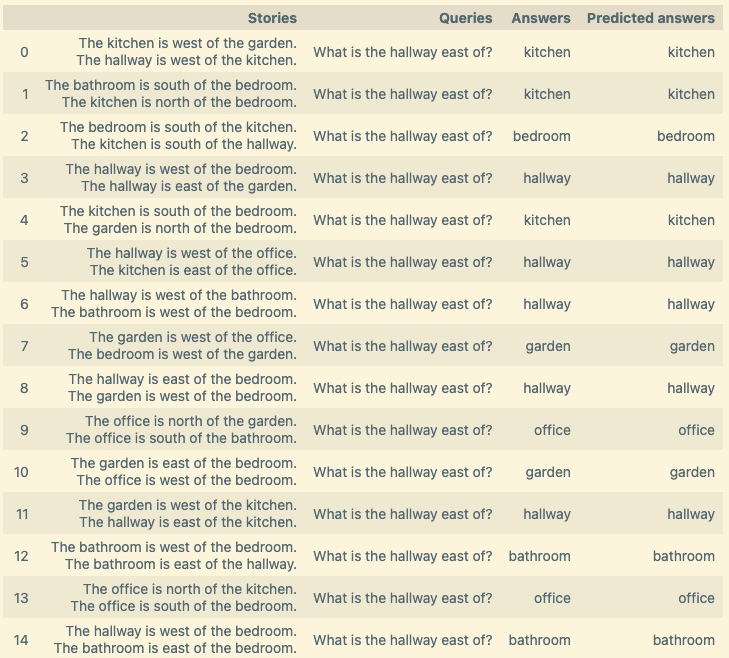

# Recurrent Neural Networks: Transformers for natural-language recognition. 

We'll use Facebook's BABI20 dataset to train and evaluate our transformer. BABI20 includes a set of 20 types of basic natural-language tasks. Here we'll focus on **Task#4**, which data 
is structured as:
  1. A `story`, composed of two sentences logically connected. 
  2. A `query`, answering this question implies that the NN has gained **an understanding** of the story. 
  3. An `answer`, used to compare against our `predicted answer` and thus train the NN. 

## Tensorflow implementation ([Link to Jupyter notebook](http://nbviewer.org/github/luis-agapito/AI_natural_language/blob/main/notebooks/tensorflow_natural_language.ipynb?flush_cache=True))

Below is a snapshot showing the performance of our trained transformer which correctly answered language queries (compare columns 'Answers' vs. 'Predicted answers').

